# MMFM model with IconQA dataset

<div style="text-align: center;">
    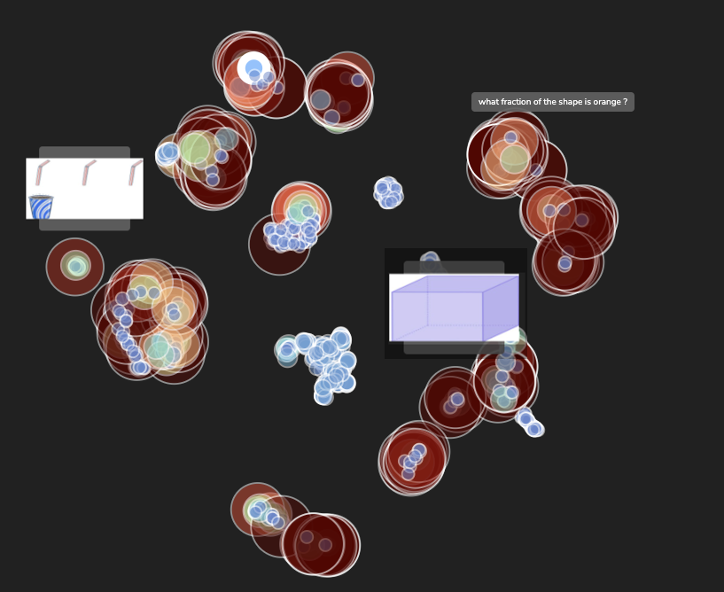
</div>

<br>

The [IconQA](https://github.com/lupantech/IconQA/tree/main) (icon question answering) dataset aims to highlight the 
importance of abstract diagram understanding and comprehensive cognitive reasoning in real-world diagram word problems. 
It consists of three sub-tasks: multi-image-choice, multi-text-choice, and filling-in-the-blank. 
IconQA requires not only perception skills like object recognition and text understanding, but also diverse cognitive 
reasoning skills, such as geometric reasoning, commonsense reasoning, and arithmetic reasoning.

In this project we used the multi-text-choice data with a pre-trained Multimodal Foundation Model.

Using **Tensorleap** we can explore the latent space, easily detect unlabeled clusters, and handle those with high loss. 
This quick start guide will walk you through the steps to get started with this example repository project.

### Population Exploration

Below is a population exploration plot. It represents a samples similarity map based on the model's latent space,
built using the extracted features of the trained model.

It shows a visualization of the latenat space where each dot represent a smple. The color and the size affected from the loss value.
In our case the latent space is clustered by the questions.

<div style="text-align: center;">
    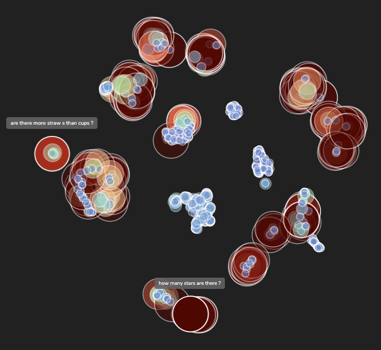
</div>

<br>

### *Detecting High Loss Clusters*

#### *Using Tensorleap Insight*

When filtering the latent space by the higher loss samples the first "low performance" insight correlated to "how" 
question word among other metadata, indicates that when need to estimate how many marbles are in the image the model fails

<div style="display: flex; justify-content: center;">
  <div style="flex: 1; text-align: center;">
    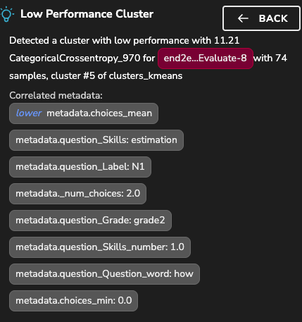
  </div>
  <div style="display: flex; flex-direction: row;">
    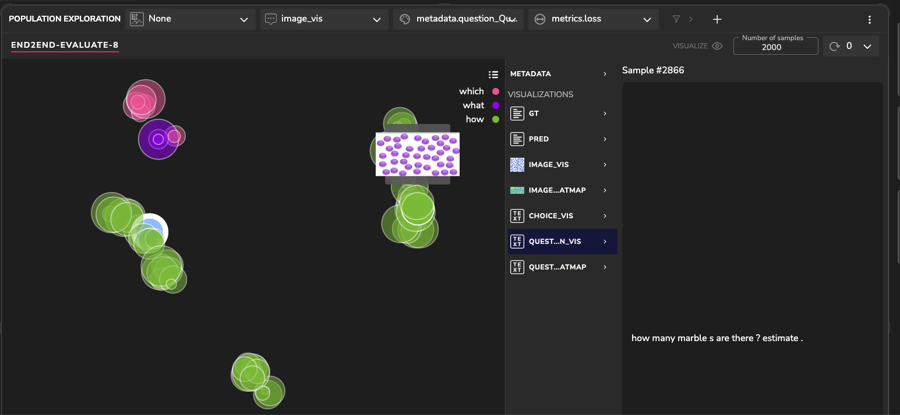
    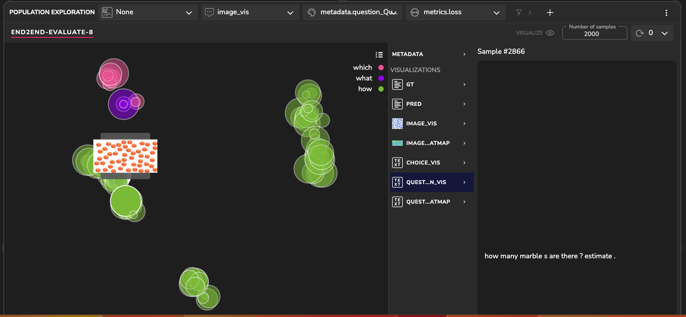
  </div>
</div>

This is some more text in my README.
#### *- Using PE*

When we lookin on the PE (population exploration) we can see that there is a group in the upper side of the latent space that contains 
images with the same question - “on which color is the spin ner less likely to land?“

<div style="text-align: center;">
    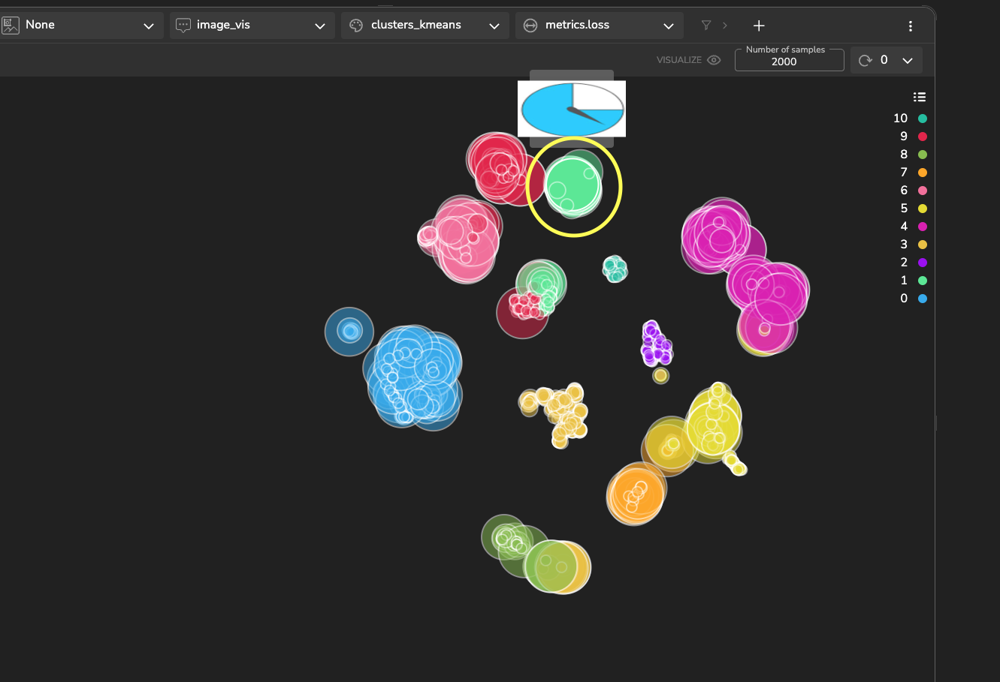
</div>

<br>

Investigating more lead to the conclusion that the model always choose “white” as the answer.

<div style="display: flex; justify-content: center;">
  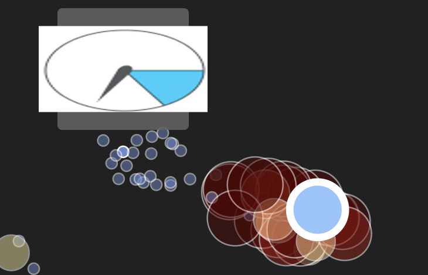
  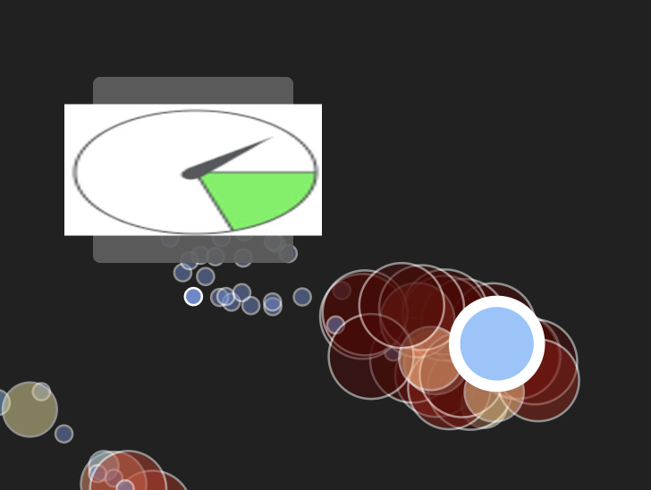
  
  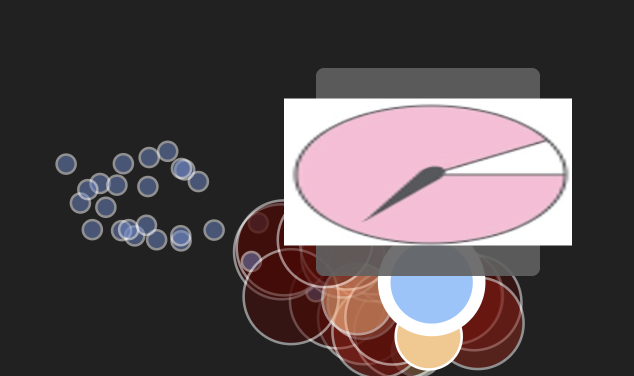
</div>

#### *- Using Dashboards*

In tensorleap platform we can create and use dashboards in an easy way.
Each sample contains required skills (one or more) to answer the question correctly.
Using the dashboard, we found that tasks containing the 'fraction' skill tend to have a higher loss value.

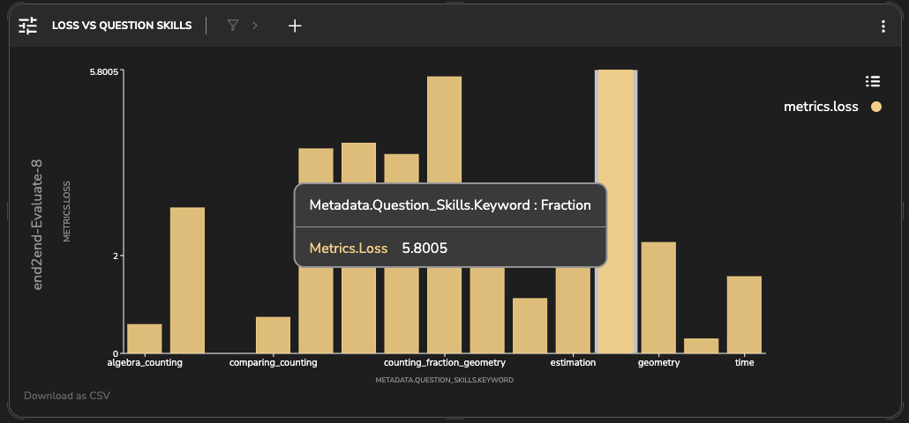

### *Detecting Unlabeled Clusters in the Latent Space*
Now, let’s look for additional clusters in our data using an unsupervised clustering algorithm on the model’s latent
space.

Upon examination of these clusters, we can see that clusters 6, 13 and 18, located close to each other, 
contain different question and images, but they are all related to time and clock. 
The proximity of these clusters in the latent space suggests that the model has recognized a higher-level relationship 
among these concepts, grouping them together due to their shared relevance to the theme of time and clocks.

<div style="text-align: center;">
    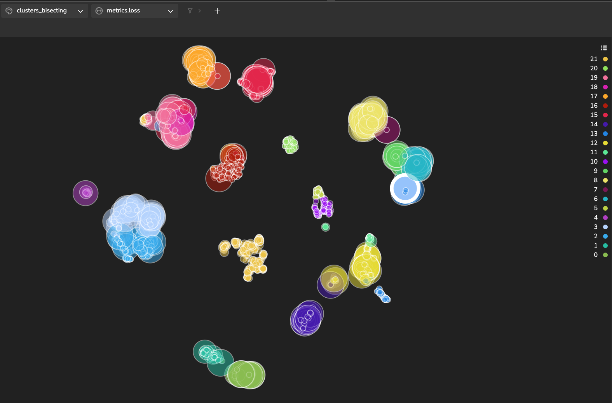
</div>

<br>


**When filtering the latent space by the higher loss samples we got samples that most of the questions focus on 
counting object and return a number:

“if you select a marble without looking , which color are you more likely to pick ?”
“how many rectangles are there ?“**

### *Fetching similar samples*

Another approach to finding clusters using the model’s latent space is fetching similar samples to a selected sample.
It enables you to identify a cluster with an intrinsic property you want to investigate. 
By detecting this cluster, you can gain insights into how the model interprets this sample and, in general, retrieve 
clusters with more abstract patterns.

The figure below illustrates a cluster of images accompanied by the question: "what has been done to this letter?"

<div style="text-align: center;">
    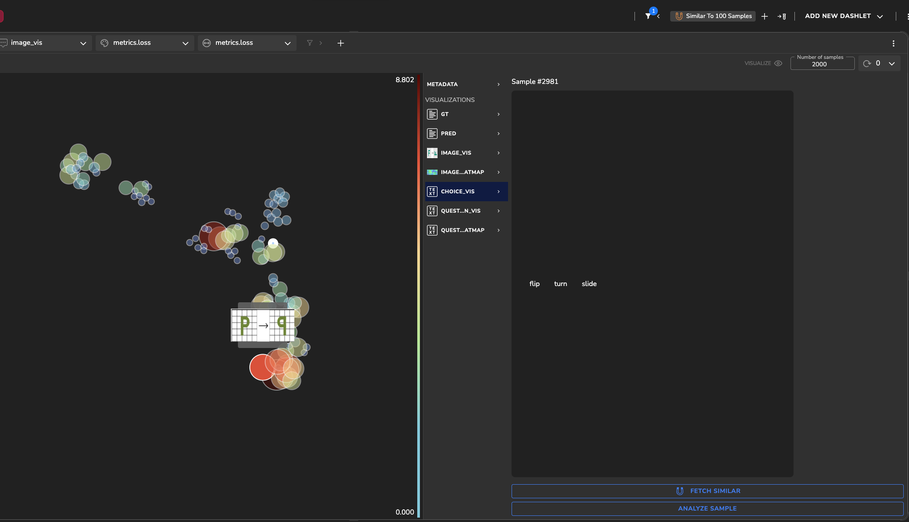
</div>

<br>

Upon analysis, we observed a notable trend where the model consistently struggles when the ground truth answer is 'flip'. 
This difficulty suggests a specific challenge for the model in accurately identifying changes related to flipping letters.

<div style="display: flex; justify-content: center;">
  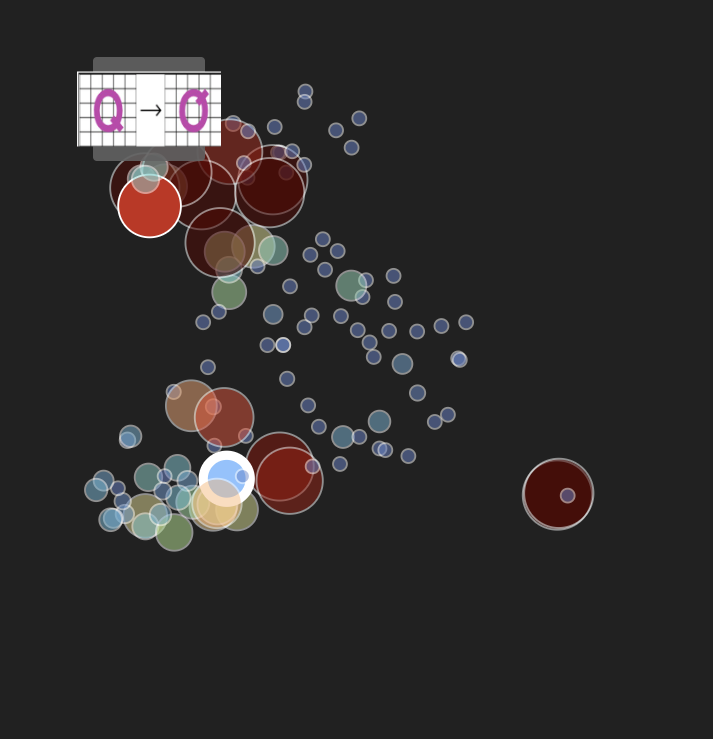
  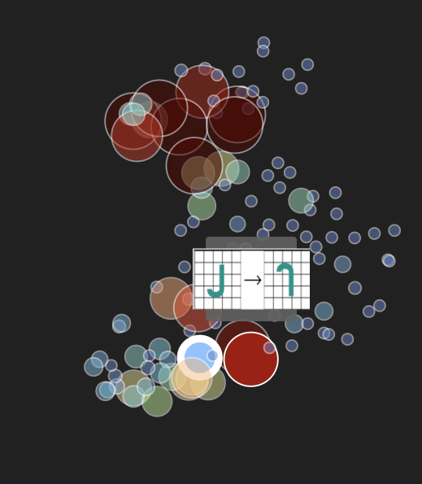
</div>


#### *Sample Loss Analysis*


**?? need** 

In this section, we can see the results of a gradient-based explanatory algorithm to interpret what drives the model to 
make specific predictions. It enables us to analyze which of the informative features contributes most 
to the loss function. We then generate a heatmap with these features that shows the relevant information.

Let’s analyze the following sample containing the question: “when did Beyonce release ‘formation’?”. The correct 
predicted answer is: “February 6, 2016”. We see that the tokens that had the most impact on the model’s prediction are:
‘when’, ‘one’, ‘day’, ‘before’. Also, the answer tokens:’ February’, ‘6’,’ 2016′.


# Getting Started with Tensorleap Project

This quick start guide will walk you through the steps to get started with this example repository project.

## Prerequisites

Before you begin, ensure that you have the following prerequisites installed:

- **[Python](https://www.python.org/)** (version 3.7 or higher).
- **[Poetry](https://python-poetry.org/)**.
- **[Tensorleap](https://tensorleap.ai/)** platform access. To request a free trial click [here](https://meetings.hubspot.com/esmus/free-trial).
- **[Tensorleap CLI](https://github.com/tensorleap/leap-cli)**.


## Tensorleap **CLI Installation**

with `curl`:

```
curl -s https://raw.githubusercontent.com/tensorleap/leap-cli/master/install.sh | bash --> OK?
```

## Tensorleap CLI Usage

### Tensorleap **Login**

To login to Tensorleap:

```
tensorleap auth login [api key] [api url].
```

- API Key is your Tensorleap token (see how to generate a CLI token in the section below).
- API URL is your Tensorleap environment URL: https://api.CLIENT_NAME.tensorleap.ai/api/v2

<br>

**How To Generate CLI Token from the UI**

1. Login to the platform in 'CLIENT_NAME.tensorleap.ai'
2. Scroll down to the bottom of the **Resources Management** page, then click `GENERATE CLI TOKEN` in the bottom-left corner.
3. Once a CLI token is generated, just copy the whole text and paste it into your shell.


## Tensorleap **Project Deployment**

To deploy your local changes:

```
leap projects push --> need to change in the rest
```

### **Tensorleap files**

Tensorleap files in the repository include `leap_binder.py` and `leap.yaml`. The files consist of the  required configurations to make the code integrate with the Tensorleap engine:

**leap.yaml**

leap.yaml file is configured to a dataset in your Tensorleap environment and is synced to the dataset saved in the environment.

For any additional file being used, we add its path under the `include` parameter:

```
include:
    - leap_binder.py
    - mmfm/configs.py
    - [...]
```

**leap_binder.py file**

`leap_binder.py` configures all binding functions used to bind to Tensorleap engine. These are the functions used to evaluate and train the model, visualize the variables, and enrich the analysis with external metadata variables

## Testing

**To test the system we can run `leap_test.py` file using poetry:

```
poetry run test
```**

This file will execute several tests on leap_binder.py script to assert that the implemented binding functions: preprocess, encoders,  metadata, etc,  run smoothly.

*For further explanation please refer to the [docs](https://docs.tensorleap.ai/)*


