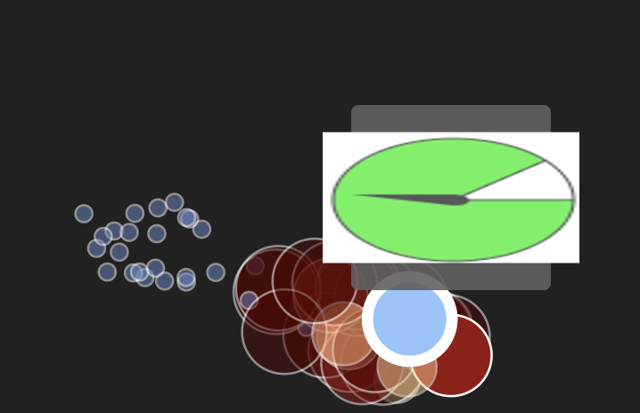

# MMFM model with IconQA dataset


The [IconQA](https://github.com/lupantech/IconQA/tree/main) (icon question answering) dataset aims to highlight the 
importance of abstract diagram understanding and comprehensive cognitive reasoning in real-world diagram word problems. 
IconQA consists of three sub-tasks:multi-image-choice, multi-text-choice, and filling-in-the-blank. 
IconQA requires not only perception skills like object recognition and text understanding, but also diverse cognitive 
reasoning skills, such as geometric reasoning, commonsense reasoning, and arithmetic reasoning.

In this project we used the multi-text-choice data with the pre-trained Multimodal Foundation Model.

Using **Tensorleap** we can explore the latent space, easily detect unlabeled clusters, and handle those with high loss. 

This quick start guide will walk you through the steps to get started with this example repository project.

### Population Exploration

Below is a population exploration plot. It represents a samples similarity map based on the model's latent space,
built using the extracted features of the trained model.

We can see that the latent space is separated by the questions type.


When filtering the latent space by the higher loss samples we got samples that most of the questions focus on 
counting object and return that number:

“if you select a marble without looking , which color are you more likely to pick ?”
“how many rectangles are there ?“

#### *Detecting High Loss Clusters*

When filtering the latent space by the higher loss samples the first "low performance" insight correlated to "how" 
question word and **more**, indicates that when need to estimate how many marbles are in the image the model fails

<div style="display: flex">
  
  
  
  
</div>

#----------------------------------------

There is a group in the upper side of the PE that contains images in this style:


The question is- “on which color is the spin ner less likely to land?“
The model always choose “white” as the answear.

<div style="display: flex">
  
  
  
  
</div>


Another way is using dashboards-we can create and use the TensorLeap dashboard in an easy way. 
Using the dashboard, we can see that tasks containing the 'fraction' skill have a higher loss.


#### *Detecting Unlabeled Clusters in the Latent Space*
Now, let’s look for additional clusters in our data using an unsupervised clustering algorithm on the model’s latent
space.

Upon examination of these clusters, we can see that clusters 6, 13 and 18, located close to each other, 
contain different question and images, but they are all related to time and clock. 


#### *Fetching similar samples*

Another approach to finding clusters using the model’s latent space is fetching similar samples to a selected sample.
It enables you to identify a cluster with an intrinsic property you want to investigate. 
By detecting this cluster, you can gain insights into how the model interprets this sample and, in general, retrieve 
clusters with more abstract patterns.

The figure below shows a cluster pf images with question of: " what has been done to this letter?"


We had notice that the model tend to fail when the ground truth answer is 'flip'.

<div style="display: flex">
  
  
</div>


#### *Sample Loss Analysis*


**?? need** 

In this section, we can see the results of a gradient-based explanatory algorithm to interpret what drives the model to 
make specific predictions. It enables us to analyze which of the informative features contributes most 
to the loss function. We then generate a heatmap with these features that shows the relevant information.

Let’s analyze the following sample containing the question: “when did Beyonce release ‘formation’?”. The correct 
predicted answer is: “February 6, 2016”. We see that the tokens that had the most impact on the model’s prediction are:
‘when’, ‘one’, ‘day’, ‘before’. Also, the answer tokens:’ February’, ‘6’,’ 2016′.


# Getting Started with Tensorleap Project

This quick start guide will walk you through the steps to get started with this example repository project.

## Prerequisites

Before you begin, ensure that you have the following prerequisites installed:

- **[Python](https://www.python.org/)** (version 3.7 or higher).
- **[Poetry](https://python-poetry.org/)**.
- **[Tensorleap](https://tensorleap.ai/)** platform access. To request a free trial click [here](https://meetings.hubspot.com/esmus/free-trial).
- **[Tensorleap CLI](https://github.com/tensorleap/leap-cli)**.


## Tensorleap **CLI Installation**

with `curl`:

```
curl -s https://raw.githubusercontent.com/tensorleap/leap-cli/master/install.sh | bash
```

## Tensorleap CLI Usage

### Tensorleap **Login**

To login to Tensorleap:

```
tensorleap auth login [api key] [api url].
```

- API Key is your Tensorleap token (see how to generate a CLI token in the section below).
- API URL is your Tensorleap environment URL: https://api.CLIENT_NAME.tensorleap.ai/api/v2

<br>

**How To Generate CLI Token from the UI**

1. Login to the platform in 'CLIENT_NAME.tensorleap.ai'
2. Scroll down to the bottom of the **Resources Management** page, then click `GENERATE CLI TOKEN` in the bottom-left corner.
3. Once a CLI token is generated, just copy the whole text and paste it into your shell.


## Tensorleap **Project Deployment**

To deploy your local changes:

```
leap project push
```

### **Tensorleap files**

Tensorleap files in the repository include `leap_binder.py` and `leap.yaml`. The files consist of the  required configurations to make the code integrate with the Tensorleap engine:

**leap.yaml**

leap.yaml file is configured to a dataset in your Tensorleap environment and is synced to the dataset saved in the environment.

For any additional file being used, we add its path under the `include` parameter:

```
include:
    - leap_binder.py
    - mmfm/configs.py
    - [...]
```

**leap_binder.py file**

`leap_binder.py` configures all binding functions used to bind to Tensorleap engine. These are the functions used to evaluate and train the model, visualize the variables, and enrich the analysis with external metadata variables

## Testing

To test the system we can run `leap_test.py` file using poetry:

```
poetry run test
```

This file will execute several tests on leap_binder.py script to assert that the implemented binding functions: preprocess, encoders,  metadata, etc,  run smoothly.

*For further explanation please refer to the [docs](https://docs.tensorleap.ai/)*


